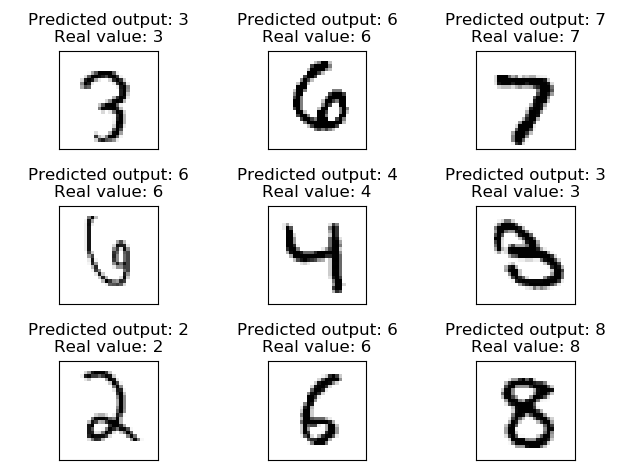
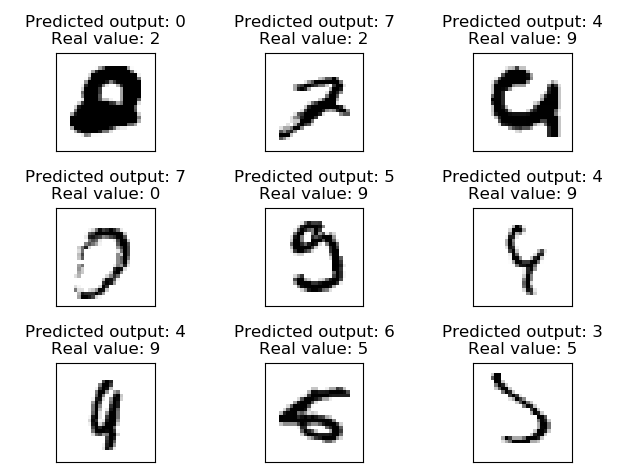

# MNIST
Using the MNIST dataset, I experimented some using a CNN to classify the dataset. Per now, the model achieves a 99.6% 
accuracy with dropout and image augmentation enabled.

## Model layout

| Layer           | Params                                   |
| -------------   |------------------------------------------|
| Input           | Input: 28, 28, 1                         |
| Convolution 2D  | Filter size: 32   Kernel size: 3      |
| _ReLU_          |                                          |
| Max pool 2D     | Kernel size: 2                           |
| Convolution 2D  | Filter size: 64   Kernel size: 2      |
| _ReLU_          |                                          |
| Max pool 2D     | Kernel size: 2                           |
| Dropout         | 30%                                      |
| Dense           | Number of units: 1024                    |
| _ReLU_          |                                          |
| Dropout         | 70%                                      |
| Dense           | 10                                       |
| _Softmax_       |                                          |

## Dataset
The dataset used, is the MNIST dataset. The dataset is divided into 55000 training images, and 10000 validation images

## Avoiding overfitting
### Dropout
To avoid the model overfitting, I used two dropout layers with 30% and 70% keeping probability.
### Augmentation
The model utilizes image augmentation. Specifically it uses a random rotation with a maximum rotation of 20 degrees.
No other augmentation has been tested at the moment

## Results
The model achieves different results based on the hyperparameteres. By using 10 epochs, the model already achieves around 
99% accuracy. The most epochs I have tried to train with, was 100, and the model then achieved a 99.58% accuracy on the 
validation set, and I imagine that the model has converged on this point.

These results are taken randomly from the testdata:

The images picked in this image are quite average, and should be no problem for the model to predict, as seen on the
results

However, there are some examples that the model predicts wrongly. Of the 10000 validation images, the model predicts
47 of them wrong. 

Here are nine examples:

Some of these are quite tricky even for a human to understand, so it is understandable that the model has some problems 
with these.
